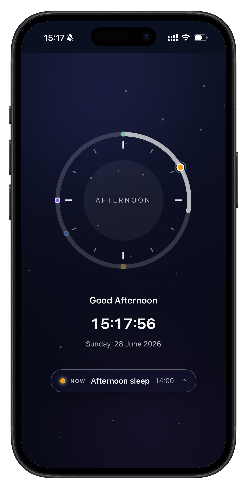
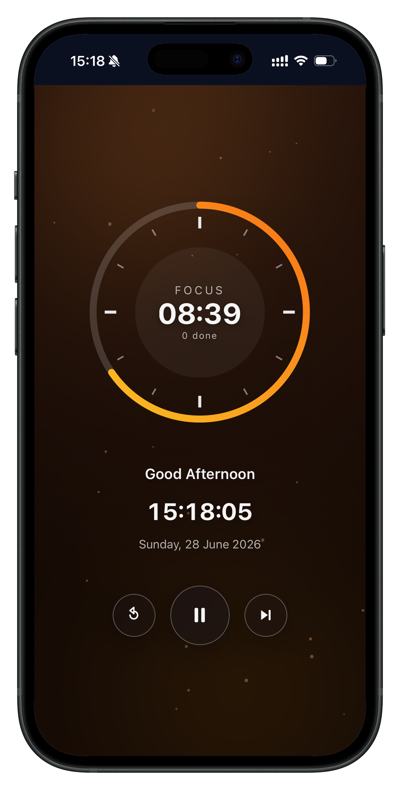

# Clocky · Daily Rhythm

A minimal, full-screen daily time-awareness dashboard built around a clock dial.
Built with **React 19**, **TypeScript**, and **Vite**, with a glassmorphism UI on
a calm, static dark theme. Clicking the center of the clock switches between two
modes: a daily **Activity** schedule and a **Pomodoro** focus timer.

<div style="display: flex">
  
  
</div>

## Features

- **Clock dial** with hour ticks and a progress ring. Click the center to toggle
  between Activity and Pomodoro mode (the chosen mode persists in LocalStorage).
- **Activity mode**
  - A day-progress ring that completes one full turn every **12 hours**.
  - **Activity markers** plotted around the dial at their 12-hour analog
    position. The current activity is emphasized; already-started ones fade.
  - Add, edit, delete, and color-tag activities with optional descriptions via
    the schedule modal. Activities are saved to **LocalStorage**.
  - The current activity ("Now") is surfaced on a button below the clock; the
    most recent activity at or before now is active, wrapping overnight to the
    last activity of the day.
- **Pomodoro mode**
  - Classic **25-minute focus / 5-minute break** timer that auto-advances
    focus → break → focus.
  - The ring shows progress through the current phase and is color-coded
    (amber for focus, green for break); the center shows the remaining time and
    count of completed focus sessions.
  - Start/Pause, Reset, and Skip controls. The countdown tracks an absolute
    deadline, so it stays accurate even if the tab is throttled.
- **Period awareness** — Dawn, Morning, Afternoon, Evening, and Night drive the
  greeting and the period label shown on the dial (the background stays a static
  dark theme).
- **Daily info** — current time, date, and a contextual greeting.
- **Ambient background** — a dark gradient with soft glows and slow-drifting
  particles, laid out deterministically so it's stable across renders.
- **Glassmorphism panels** — frosted glass, soft shadows, blur, and subtle
  borders.
- **Responsive** — works full-screen on desktop and stacks for mobile. Respects
  `prefers-reduced-motion`.

## Getting started

```bash
npm install
npm run dev      # start the dev server
npm run build    # type-check + production build
npm run preview  # preview the production build
npm run lint     # run ESLint
```

## Project structure

```
src/
  components/   Background, Clock, InfoPanel, ActivityPanel, ActivityForm,
                PomodoroControls, Modal (+ CSS)
  hooks/        useNow (ticking clock), useActivities (LocalStorage CRUD),
                usePomodoro (25/5 timer state)
  utils/        time helpers (periods, greeting, day progress, formatting)
  types.ts      shared types (Activity, Period, ClockMode, PomodoroPhase)
  App.tsx       layout composition + mode state
```

### Time model

- The **day-progress ring** maps a fraction of a 12-hour cycle.
- **Activity markers** use a 12-hour analog position (`((startMinute / 60) % 12)
  * 30°` from the top), so morning/evening times (e.g. 06:00 and 18:00) overlap
  on the same spot by design.
- Activity start times are stored as **minutes from midnight**, converted to/from
  `HH:MM` only at the UI edge.
